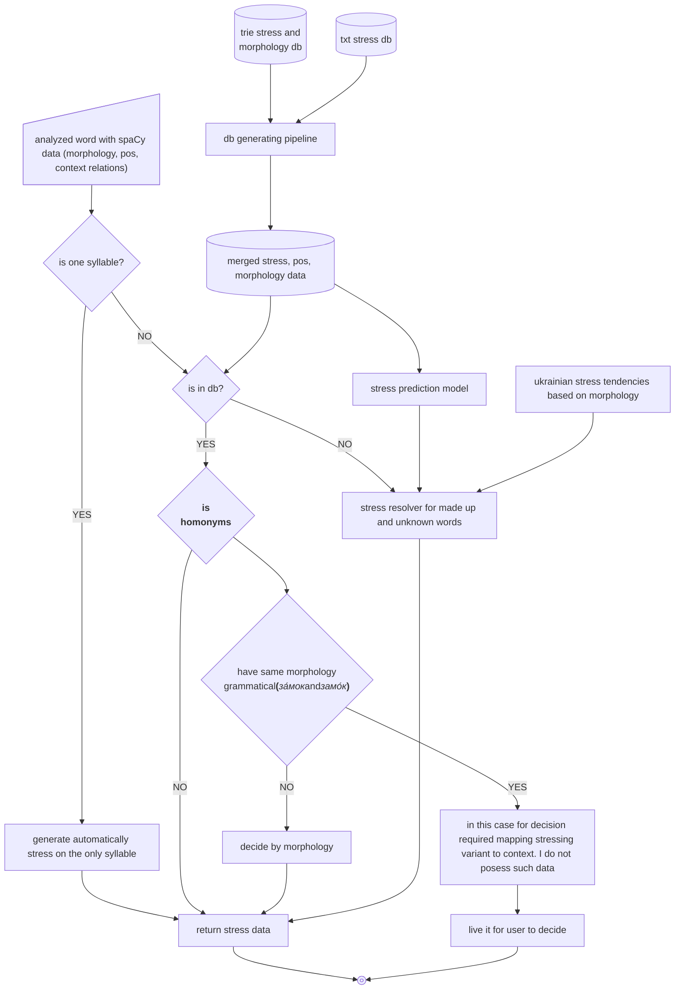

```mermaid
flowchart TB
C["is one syllable?"] -- YES --> D["generate automatically stress on the only syllable"]
C -- NO --> F["is in db?"]
A["analyzed word with spaCy data (morphology, pos, context relations)"] --> C
n2["trie stress and<br>morphology db"] --> n6["db generating pipeline"]
n3@{ label: "<span style=\"padding-left:\">merged stress, pos, morphology data</span>" } --> F & n14["stress prediction model"]
F -- YES --> n4@{ label: "<b data-path-to-node=\"18,0\" data-index-in-node=\"26\"><b>is<br>homonyms</b></b>" }
F -- NO --> n5@{ label: "<span style=\"padding-left:\">stress resolver for made up and unknown words</span>" }
n6 --> n3
n1["txt stress db"] --> n6
D --> n8["return stress data"]
n4 -- NO --> n8
n4 --> n9@{ label: "have same morphology<br><span style=\"padding-left:\"><span style=\"padding-left:\">grammatical</span><b data-path-to-node=\"18,0\" data-index-in-node=\"26\">(</b><span><span class=\"w-content\"><i>за́мок</i><span></span>and<i>замо́к</i></span></span><b data-path-to-node=\"18,0\" data-index-in-node=\"26\">)</b></span>" }
n9 -- NO --> n10["decide by morphology"]
n10 --> n8
n9 -- YES --> n11["in this case for decision required mapping stressing variant to context. I do not posess such data"]
n11 --> n12["live it for user to decide"]
n8 --> n13["Untitled Node"]
n12 --> n13
n5 --> n8
n14 --> n5
n15["ukrainian stress tendencies based on morphology"] --> n5

    C@{ shape: decision}
    F@{ shape: decision}
    A@{ shape: manual-input}
    n2@{ shape: db}
    n6@{ shape: proc}
    n3@{ shape: db}
    n4@{ shape: decision}
    n5@{ shape: rect}
    n1@{ shape: db}
    n9@{ shape: decision}
    n13@{ shape: stop}
    n15@{ shape: proc}
```
